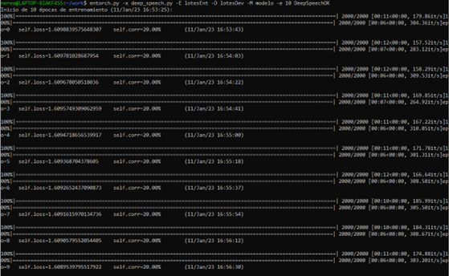
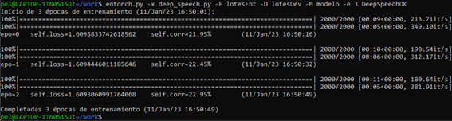
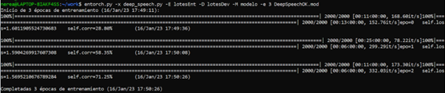
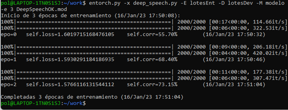
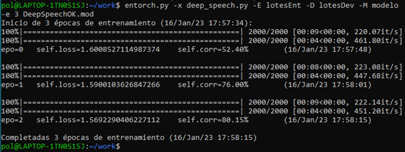
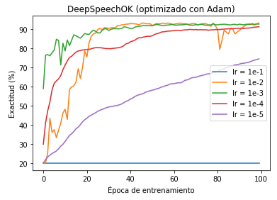

### Nerea González y Pol Naharro

TecParla - Treball Final de Reconeixement
=========================================

Para realizar este trabajo primero se ha realizado un fork. A continuación, se ha descargado la carpeta mediante el uso de "git" y se ha procedido a la instalación y preparación del entorno. Con esto último se quiere decir dos cosas: Preparar los Paths en el fichero bashrc y modificar las direcciones de los directorios. En nuestro caso, el directorio _"Prm"_ se ha cambiado por _"Prm/cepstrum.9.5.20"_ dado que este era compartido por los estudiantes.
Aparte, comentar que, en las pruebas de funcionamiento nos hemos dado cuenta de que a partir del apartado de _"DeepSpeech"_ de los apuntes, los resultados dejan de concordar con los obtenidos por nosotros, con los valores por defecto. Por eso se puede observar como los resultados que se muestren en los siguientes ejercicios son ligeramente inferiores a los de los apuntes. 

## Reparación de DeepSpeech -> DeepSpeechOK

##### _Adjunte a continuación la parte o partes del código fuente que ha tenido que modificar para corregir el error._

El cambio principal se ha realizado en la línia "x = torch.nn.functional.hardtanh(x, 0, self.relu_max_clip)". A esta, se le han añadido a los dos últimos parámetros la conversión a float de los int que entraban para poderse guardar en el modelo en el proceso.

```py
    def forward(self, x: torch.Tensor) -> torch.Tensor:
        x = self.fc(x)
        x = torch.nn.functional.relu(x)
        x = torch.nn.functional.hardtanh(x, float(0), float(self.relu_max_clip))
        if self.dropout:
            x = torch.nn.functional.dropout(x, self.dropout, self.training)
        return x
```

Aparte para evitar llamar a la función antigua de _"DeepSpeech"_, se ha realizado el cambio de nombre de la clase a _"DeepSpeechOK"_.

```py
class DeepSpeechOK(torch.nn.Module):
    """DeepSpeech architecture introduced in
    *Deep Speech: Scaling up end-to-end speech recognition* :cite:`hannun2014deep`.

    Args:
        n_feature: Number of input features
        n_hidden: Internal hidden unit size.
        n_class: Number of output classes
    """

    def __init__(
        self,
        n_feature: int,
        n_hidden: int = 2048,
        n_class: int = 40,
        dropout: float = 0.0,
    ) -> None:
        super(DeepSpeechOK, self).__init__()
        self.n_hidden = n_hidden
        self.fc1 = FullyConnected(n_feature, n_hidden, dropout)
        self.fc2 = FullyConnected(n_hidden, n_hidden, dropout)
        self.fc3 = FullyConnected(n_hidden, n_hidden, dropout)
        self.bi_rnn = torch.nn.RNN(n_hidden, n_hidden, num_layers=1, nonlinearity="relu", bidirectional=True)
        self.fc4 = FullyConnected(n_hidden, n_hidden, dropout)
        self.out = torch.nn.Linear(n_hidden, n_class)
```

##### _Inserte una captura que muestre un par de iteraciones de entrenamiento de una red DeepSpeechOK usando entorch.py y sin que se produzca error al escribir el modelo._

Valores por defecto (lr=1.e-5)
 * 10 épocas de entrenamiento:




 * 3 épocas de entrenamiento:



######
A continuación hemos realizado pruebas con 3 épocas de entrenamiento y diferentes lr, para intentar obtener resultados mejores.

* lr=9.5e-3


* lr=9.5e-3


* lr=9.8e-3



## Optimización de la topología del perceptrón multicapa

##### _Inserte a continuación una tabla (de markdown) con los mejores resultados obtenidos para cada función de activación._

Activación               |ReLU                  |Sigmoide               |Hardtanh
-------------------------| :-------------------:|:-------------------:  | :--------------------:
__Capas__                |3                     |3                      |3             
__Nodos__                |2048                  |512                    |2048            
__Exactitud__            |89.55%                |87.05%                 |88.40%


## Optimización del paso de aprendizaje de Adam para el entrenamiento de DeepSpeechOK

##### _Inserte una gráfica con la evolución durante 100 épocas de entrenamiento para cada uno de los valores probados. El resultado debería ser semejante al publicado en la página 38 del fichero neuras.pdf._

Como se puede observar en la imagen siguiente, al aumentar el número de épocas, los resultados obtenidos mejoran considerablemente, pero, aun así, los mejores son aproximadamente un 4% inferiores a los de los apuntes. Los mejores resultados han sido de aproxiamdamente un 92.5% y se han obtenido con el lr de 1e-2 y 1e-3.


