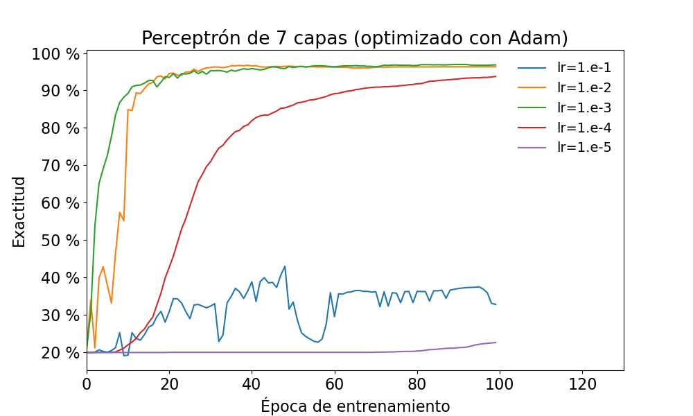

TecParla - Treball Final de Reconeixement
=========================================

Esta tarea se distribuye a través del repositorio GitHub [Ramses](https://github.com/albino-pav/neuras),
y la mayor parte de su gestión se realizará mediante esta web de trabajo colaborativo.  Al contrario que
Git, GitHub se gestiona completamente desde un entorno gráfico bastante intuitivo. Además, está 
razonablemente documentado, tanto internamente, mediante sus [Guías de GitHub](https://guides.github.com/),
como externamente, mediante infinidad de tutoriales, guías y vídeos disponibles gratuitamente en internet.

Para inicializar el repositorio de la tarea, siga las instrucciones del repositorio original de la
asignatura, [Ramses](https://github.com/albino-pav/ramses).

Con independencia de dónde haya descargado el repositorio de esta tarea, es importante que tenga en cuenta
algunas cuestiones:

- Añada el directorio `neuras` (donde quiera que esté) a las variables de entorno `PATH` y `PYTHONPATH` para 
  poder acceder a los programas y módulos que se adjuntan.
  + Es aconsjeble que `neuras` aparezca antes que `ramses` para que los programas y módulos definidos en ella
	tengan prioridad sobre los de `ramses`.
- Procure ejecutar todos los programas desde el directorio `work`. Si las variables de entorno son correctas,
  no deberá tener ningún problema.
- Recuerde que sólo los ficheros contenidos en el directorio donde se descargue el repositorio son mantenidos
  por Git/GitHub. Copie, enlace o haga lo que considere oportuno para incluir todos los ficheros pedidos en
  esta tarea es ese directorio.
  + La entrega de la tarea se realiza mediante un *pull request* desde el *fork* del repositorio.
- No dude en consultar lo que sea necesario a los profesores de la asignatura.

Entrega de la tarea.
--------------------

Responda, en este mismo documento (README.md), los ejercicios indicados a continuación. Este documento es
un fichero de texto escrito con un formato denominado _**markdown**_. La principal característica de este
formato es que, manteniendo la legibilidad cuando se visualiza con herramientas en modo texto (`more`,
`less`, editores varios, ...), permite amplias posibilidades de visualización en modo gráfico en una amplia
gama de aplicaciones; muy notablemente, **GitHub**, **Doxygen** y **Facebook** (ciertamente, :thumbsup:).

En GitHub. cuando existe un fichero denominado README.md en el directorio raíz de un repositorio, se
interpreta y muestra al entrar en el repositorio. También lo hace al acceder a cualquier subdirectorio
del repositorio.

Debe redactar las respuestas a los ejercicios usando Markdown. Puede encontrar información acerca de su
sintáxis en la página web [Sintaxis de Markdown](https://daringfireball.net/projects/markdown/syntax).
También puede consultar el documento adjunto [MARKDOWN.md](MARKDOWN.md), en el que se enumeran los
elementos más relevantes para completar la redacción de esta práctica.

Recuerde realizar un *pull request* una vez completada la práctica.

Ejercicios.
-----------

### Reparación de DeepSpeech -> DeepSpeechOK

El formato empleado por `entorch.py` y `recorch.py` para la escritura y lectura las redes neuronales de 
PyTorch es TorchScript. Este formato tiene la ventaja de que almacena la estructura junto con sus parámetros,
lo cual simplifica mucho la tarea. Un problema que aparece es que la conversión a formato TorchScript exige
coherencia absoluta en los tipos de datos empleados. Algo que, justamente, no es habitual en Python.

Hay un punto en la definición empleada por PyTorch de la red neuronal
[DeepSpeech](https://pytorch.org/audio/stable/generated/torchaudio.models.DeepSpeech.html) en la que esta
coherencia no existe: la invocación a la función `torch.nn.functional.hardtanh()` usa enteros como valores
límite, cuando su definición exige reales.

En este ejercicio deberá escribir una versión *reparada* de DeepSpeech, que llamará DeepSpeechOK y almacenará
en el fichero `neuras/deepspeechok.py`. Para ello, se recomienda seguir los pasos siguientes:

1. Acceda a la página de DeepSpeech en PyTorch y localice el enlace al código fuente (indicado por el enlace
`[SOURCE]`).
2. Copie el código fuente al fichero `neuras/deepspeechok.py` y cambie el nombre de la red a `DeepSpeechOK`.
	- Deberá eliminar las etiquetas `[docs]` que aparecen en el código y que no son expresiones Python
	  válidas.
3. Corrija el código fuente para que no se produzca el error al intentar guardar el modelo ejecutando
  `entorch.py`

#### A entregar

- Adjunte a continuación la parte o partes del código fuente que ha tenido que modificar para corregir el error.

- Inserte una captura que muestre un par de iteraciones de entrenamiento de una red `DeepSpeechOK` usando
  `entorch.py` y sin que se produzca error al escribir el modelo.

### Optimización de la topología del perceptrón multicapa

Determine los hiperparámetros óptimos del perceptrón multicapa en la tarea de reconocimiento de las vocales del
castellano. Los hiperparámetros susceptibles de optimización son:

1. Número de capas.
2. Número de neuronas en las capas ocultas o internas.
3. Función de activación de las neuronas (por defecto, se usa ReLU; como mínimo, se ha de probar también la
   sigmoide y la hardtanh).

Se recomienda usar, en todos los casos, el optimizador Adam con un paso de aprendizaje adecuado.

Hay que tener en cuenta que unos hiperparámetros pueden depender de los otros. Es decir, tal vez el número de
capas óptimo sea distinto en función del número de neuronas por capa, y viceversa. Este problema se puede
resolver de varias maneras: por ejemplo, en lugar de optimizar cada hiperparámetro por separado, pueden
optimizarse todos de manera conjunta. Esta estrategia puede ser muy cara en términos de computación (si se
quieren probar cinco valores de cada hiperparámetro, el número total de pruebas sería $5\times 5\times 5=125$).

Se recomienda optimizar primero el número de capas y de neuronas por capa y, usando los valores óptimos, obtener
el resultado con las funciones de activación probadas. Por otro lado, para optimizar el número de capas y neuronas,
se recomienda empezar por dos valores extremos para cada uno ( $2\times 2=4$ experimentos); a la vista de los
resultados, seleccionar otros dos valores para cada uno (otros 4 experimentos), y así sucesivamente hasta obtener
el resultado óptimo.

#### A entregar

- Inserte a continuación una tabla (de markdown) con los mejores resultados obtenidos para cada función de
  activación. La tabla deberá tener un formato semejante al siguiente:

Activación|  ReLU    |    sigmoide   |   hardtanh  
----------|----------|---------------|----------- 
Capas     |          |               |             
Nodos     |          |               |             
Exactitud |          |               |             

### Optimización del paso de aprendizaje de Adam para el entrenamiento de DeepSpeechOK

Pruebe distintos valores del paso de aprendizaje usado por Adam en el entrenamiento de la red DeepSpeechOK.

#### A entregar

- Inserte una gráfica con la evolución durante 100 épocas de entrenamiento para cada uno de los valores probados.
  El resultado debería ser semejante al publicado en la página 38 del fichero `neuras.pdf`:

### Evaluación ciega del sistema de reconocimiento

Cada pareja debe realizar el reconocimiento de la parte *oculta* de la base de datos de vocales con el mejor sistema
que sean capaces de diseñar. Las parejas participantes entrarán en una competición, y una parte de la nota final
dependerá de su clasificación en la misma.

La parte oculta de la base de datos corresponde al fichero guía `Gui/eval.gui` y no contiene la transcripción
de las señales (al generar los lotes de señales deberá fijar `dirMar=None`).

#### A entregar

- El repositorio deberá contener el fichero `final.tgz` con el directorio de los ficheros de reconocimiento de la
  parte oculta de la base de datos.

  + El formato `tgz` es muy común en entornos Unix y consiste en un fichero `tar` comprimido con `gzip`. Si los
	ficheros del reconocimiento están en el directorio `Rec/final`, puede generar el fichero demandado ejecutando
	la orden `tar cvzf final.tgz Rec/final`.

### Trabajo suplementario opcional (uso del error cuadrático medio como función de coste)

Si le han quedado ganas de más, puede probar otras funciones de coste. Por defecto, el sistema usa como capa de
salida la clase `LogSoftMax` y como función de coste el logaritmo de la verosimilitud cambiada de signo,
`nll_loss()`. Esta es, seguramente, la mejor elección posible en tareas de reconocimiento como la que se está
usando en este curso.

Sin embargo, en otras tareas, como puedan ser el modelado de sistemas, la reconstrucción de señales, etc., es
más conveniente el uso del error cuadrático medio como función de coste 
([mse_loss()](https://pytorch.org/docs/stable/generated/torch.nn.functional.mse_loss.html)). El uso de esta función
de coste implica:

1. Evidentemente, hay que sustituir `nll_loss()` por `mse_loss()` en la invocación al constructor del modelo.
2. En lugar de usar como capa de salida el logaritmo del softmax, `LogSoftMax`, hay que usar el propio softmax,
   `SoftMax`. Esto también se reduce a cambiar la invocación del constructor del perceptrón.
3. `mse_loss()` exige que el objetivo de la salida de la red sea del tipo *one-shot vector*. Actualmente, el
   objetivo que usa `ModPT` es el índice de la unidad. Esta diferencia resulta en cambios más importantes que
   las otras dos:
   - Un one-shot vector es un vector de tamaño igual al del vocabulario en el que todos los elementos son cero
     salvo el correspodiente al índice de la unidad, que vale uno.
   - Para obtener el objetivo de este tipo hay que usar una función generadora de lotes diferente a la usada hasta
     ahora, `lotesPT()`. Puede, por ejemplo, crear una nueva función de nombre `lotesMSE()`, o semejante.
   - Modificar la transcripción que aparece en los lotes de señales afecta a alguno de los métodos de `ModPT`. Será
     conveniente construir una nueva clase, por ejemplo: `ModMSE`, en la que casi todo es lo mismo a `ModPT`, pero
	 con esos métodos diferentes. Puede ser buena idea que `ModMSE` sea heredera de `ModPT`...
4. Es muy probable que los parámetros de la red y/o del optimizador deban ser modificados. En especial, es muy
   probable que el paso de aprendizaje, `lr`, deba ser adaptado a la nueva función de coste.

#### A entregar

- Inserte el código de la función `lotesMSE()` que proporciona transcripciones en la forma de vector one-shot.

- Inserte el código de la clase `ModMSE` compatible con la función de coste `mse_loss()`.

- Inserte una tabla con el resultado obtenido con `nll_loss()` y `mse_loss()`
